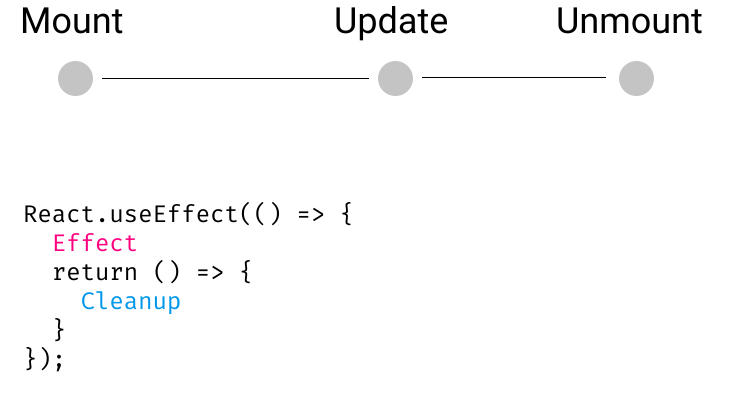
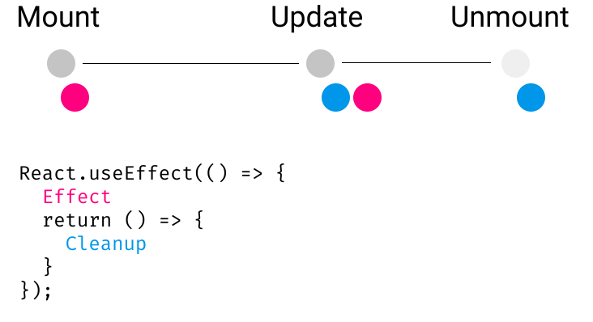
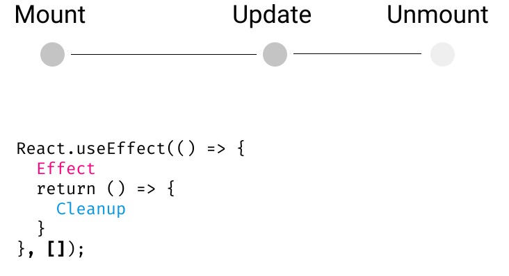
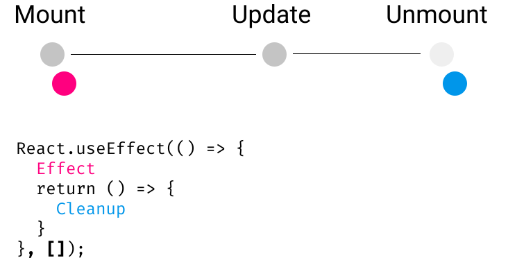
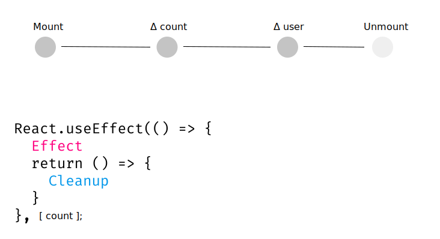
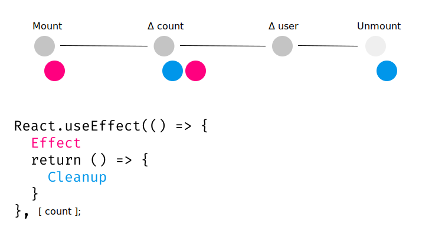

# useEffect Cleanup

---

## Cleanup aka Unsubscribing

There's one more thing to know about `useEffect`:

You can _clean stuff up_ between renders.

---

## The problem:

Let's say we have some routes:

```js
<Router>
  <Route path="/" element={<Home />} />
  <Route path="/about" element={<About />} />
</Router>
```

---

Our Home component has some sort of event listener, as well as a `Link` to "/about".

```js
const Home = () => {
  useEffect(() => {
    window.addEventListener("scroll", func());
  }, []);

  return (
    <div>
      <Link to="/about">About</Link>
    </div>
  );
};
```

---

When we click the "About" link,

The scroll handler _doesn't go away_.

Yes, the navigation has changed which components are rendered.

`<Home />` is no longer rendered, but its scroll-handler lives on.

---

## Unsubscribing

Below we have fixed the issue:

```js
const Home = () => {
  useEffect(() => {
    window.addEventListener("scroll", aFunc);

    return () => {
      window.removeEventListener("scroll", aFunc);
    };
  }, []);

  return (
    <div>
      <Link to="/about">About</Link>
    </div>
  );
};
```

Remember: we can only `return` inside a function definition

The cleanup is the `return` of the `useEffect`'s callback function.

The cleanup is not the `return` of the component itself.

---

The cleanup is a callback function returned by the original callback function

```js
useEffect(
	()=>{
		// this is the effect

		return ()=>{
			// this is the effect's cleanup

		}

	}
)
```

Here's another way of looking at it

```js
const cleanup = () => {
	// some cleanup stuff
}

const effect = () => {
	// some effect stuff
	return cleanup
}

useEffect(effect)

```

---

## Timing

Effects are never called on unmount.

Cleanups are never called on mount.

For all other renders, a cleanup can happen (if the dependency array allows it).

Cleanups are processed **right after** changes in the component life cycle (this includes unmount).

Cleanups are processed **right before** any Effects (excluding mount).

---



---



---



---



---



---



---

# Exercises

Make sure to do the appropriate cleanup work

---

```js

const App = () => {
	const [askUserToSubscribe, setAskUserToSubscribe] = useState(false)

  useEffect(() => {
    setTimeout(() => {
      setAskUserToSubscribe(true);
    } , 10000 );
  }, []);

};
```

Solution:

```js

const App = () => {
	const [askUserToSubscribe, setAskUserToSubscribe] = useState(false)

  useEffect(() => {
    const timer = setTimeout(() => {
      setAskUserToSubscribe(true);
    } , 10000 );
		return ()=>{
			clearTimeout(timer);
		}
  }, []);

};
```

---

```js
const App = () => {
  useEffect(() => {
    window.addEventListener("keydown", (ev) => {
      console.log("You pressed: " + ev.code);
    });
  }, []);
};
```

Solution:

```js
const App = () => {
  useEffect(() => {
		const handleKeyDown = (ev) => {
			console.log("You pressed: " + ev.code);
		}
    window.addEventListener("keydown", handleKeyDown);
		return ()=>{
			window.removeEventListener("keydown", handleKeyDown);
		}
  }, []);
};
```

Note that we have to use a named function.

---

The final topic will be covered during the check in.
