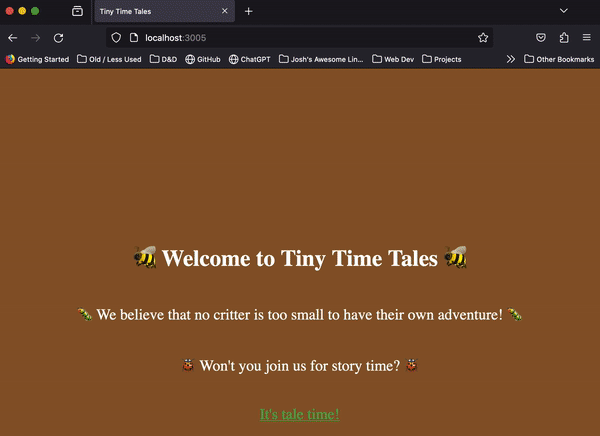

# Exercise 1: Which Tale Am I Reading?

**This exercise will make use of what you saw in Lecture Topics 3 and 5.**

---

When the application is open in the browser, we can see the document/tab's title reads: "Tiny Time Tales"

It would be nice if this were a little more dynamic.

Let's add a little more functionality to the site so that it updates to display which book is currently being viewed. It should look something like the following once you're done:

Note: You may be able to complete this exercise without the need of the Steps. If you're up for it, try to complete this without direction. If you complete it without looking at the Steps that's fantastic, but please glance through them once you're done to compare your approach to the suggested one.

---

## Step 1: Where To Start

Which component do you need to code in?

It's a pretty important question, isn't it? 😂

We want the title to change when a user moves to, or away from, the "/book/:bookId" `Route`. Thinking back on the Component Life Cycle, this means we need an effect on the mount and unmount of `<Book/>`.

So for this exercise, you'll be coding exclusively in the `<Book/>` component found at `/src/pages/Book/index.js`

Surprise, you'll be calling the `useEffect` hook! Make sure to import it.

---

## Step 2: Calling `useEffect`

`useEffect` needs to be called, unconditionally, inside the component.

`useEffect` needs to receive a callback function as its first argument.

This callback function should make the modification to the tab's title after the `<Book/>` component renders.

The new value of the tab's title is somewhere in the `foundBook` object. Feel free to `console.log` it to learn more about it.

---

## Step 3: Unmount

We want the tab's title to revert back to "Tiny Time Tales" once the user goes back to the book selection page. Now technically, we could accomplish this by adding another `useEffect` in the `<Books />` component, but then we're needlessly stretching our code out into two components.

Look back on the svg/images in lecture topic 5. How can we call a function on unmount?

Looks like we'll have to have `useEffect`'s callback function return another callback function.

Have that function revert the tab's title. Check your console, are there any issues?

---

## Step 4: Making it Bulletproof

What's the dependency array currently looking like?

Yes, we can accomplish this task with no dependency array at all, however, this presents several possible problems if the application is changed in the future. If `Book` updates, we don't want the Cleanup and Effect called again. That update could be caused by new state being coded into this component, or an update on App, or even if a `Link` to another book is added into the `<Book/>` component. 

All this to say: the dependency array should be provided, and it should be empty.

What happens if you visit "book/Bimmy" ? Or any other book title that doesn't exist? Try it!

Is there an error?

What is `foundBook` when a book isn't found? Not trying to be philosophical here - it's certainly not an object, and you can't use dot notation from it as it has no methods nor keys.

How can we safeguard against this? While we can't conditionally call `useEffect`, we can have its callback function perform effects conditionally by making it perform tests.

Ensure the application doesn't crash if a user inputs a book title that doesn't exist into the url (or perhaps they bookmark a link to a book title that is later removed).

---

With that, Exercise-1 is complete 🎉

Time to pester users with likely unwelcome invitations! [Exercise 2](./exercise-2.md)