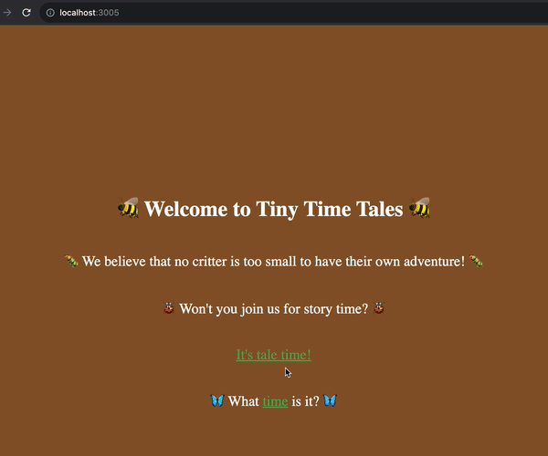

# Exercise 2: Please Join our Newsletter

---

Many websites restrict access behind a paywall or user registration. Many free services collect data through cookies or generate revenue through targeted advertisements.

While we're not sure how this website makes money, let's give them a fighting chance by collecting email addresses.

After 6 seconds, have a new component rendered under the books at "/books" that invites the user to sign up to our newsletter.

It may look something like this:



A couple things to note about this:

1. It will be entirely superficial, i.e. it won't be connected a backend in any way.

2. The `CSS` doesn't matter. The goal is to get practice with `useEffect`.

---

## Step 1: SignUp Component

Before getting into `useEffect` and conditional renders, build a new `SignUp` component in the `src/pages/Books` folder.

If you want to be thorough, it should render a `form`, with a `label`, an `input`, and a submit `button`. Make sure to `preventDefault` `onSubmit`. You'll probably need two states in this component, one for the `input`'s value and the other to track if the email has been submitted. Conditionally render a success message once the user clicks the submit `button`.

Or, you can not be thorough, and just render an `input` with no state at all as a placeholder for future functionality.

Render this in `/src/pages/Books/index.js`

---

## Step 2: Flip the Switch

Only ask the user to sign up to this newsletter if they have been on "/books" for 6 seconds.

This should involve the following:

`useEffect` (to trigger this effect)
`useState` (for the conditional render)
`setTimeout` (remember that the time it expects is in ms, so 1000 = 1s)

Think about the dependency array. Are you accidentally calling a setter every 6 seconds?  Make sure you're not seeing red in the console!

You'll need to conditionally render `<SignUp/>`.

---

## Step 3: Clean up After Yourself

We don't want the timeout's callback function being executed if the DOM is no longer rendering the `Books` component. If we don't cleanup, we're calling a setter that was created in an unmounted component (this can't accomplish anything).

Perform a cleanup that removes the timeout you set when `Books` unmounts.

Don't forget that you'll have to capture the return of `setTimeout`!

Whenever you create a variable, it's a good idea to take note of what scope it is in. When you call `setTimeout` in a function and assign it to a variable, then unless you created that variable in a nested scope, you'll have access to it later in that function's block.

```js
const someFunction = () => {
	// some logic
	const timer = setTimeout(callback, time);
	// more work

	return ()=>{
		// this callback is nested in someFunction's block
		// so it has access to any variables created directly in someFunction
	}
}
```

---

With that, Exercise-2 is complete 🎉

Now let's track how long users keep the app open: [Exercise 3](./exercise-3.md)