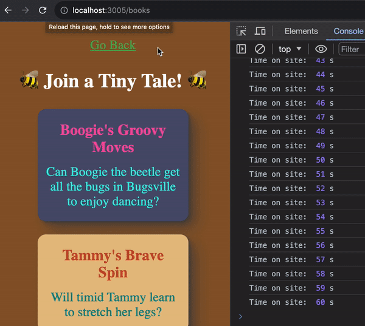

# Exercise 3: How Long Have I Been Here?

---

Many websites track how long user's have been on their website.

There are many ways to do this from cookies to server-side tracking.

Again, we won't be hooking this up to any backend, so let's just log how long users have been on the application.

Since we want these `console.log`s to be happening regardless of which `Route` a user is viewing, we should do this very high up in the DOM tree: in App.js.

We don't need `useState` here, as this doesn't demand updates on the DOM. We also don't need to cleanup, as if `<App/>` isn't being rendered, the user is no longer rendering our application.

It should look something like this:

Make sure you don't have any errors in the log, and that there isn't a multiplicity of logs occurring.

---

With that, Exercise-3 is complete 🎉

Let's practice some more tracking: [Exercise 4](./exercise-4.md)