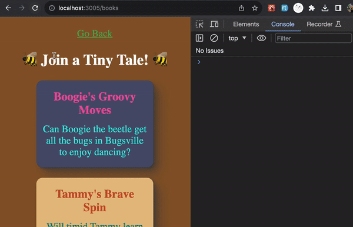

# Exercise 4: How Long Have I Been Reading?

---

The functionality of this exercise is going to be very similar to that of exercise-3.

Let's log how long a user has been reading any individual book.

In the Book component, you already have a `useEffect`. You could accomplish this exercise in that same `useEffect`, however, it will be to complete the final exercise if you create a separate `useEffect` to manage this effect independently.

This time, we absolutely have to perform a cleanup so we don't continue to get false readings after the user has moved on. We'll allow the time to reset back to 0 if they return back to a book they were previously viewing.

It should look something like this:

Again, make sure the logs make sense and that they're not multiplying.

---

With that, Exercise-4 is complete 🎉

Let's fix that clock: [Exercise 5](./exercise-5.md)