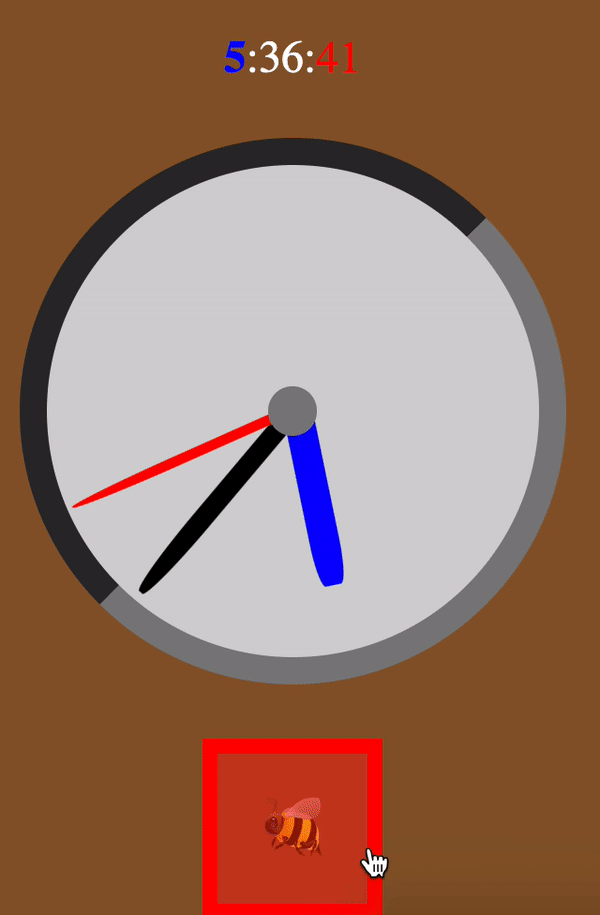

# Exercise 5: Make the Clock Tick

---

Go to the "/time" url (manually enter it or click the `Link` from the `<Introduction/>`)

You'll see a clock UI, but it isn't ticking.  If you refresh the page, you'll see the second hand move (unless you happen to be doing this 60s apart 😅).

All the changes for this exercise will take place in `/src/pages/WhatTimeIsIt/index.js`.  You won't need to modify the `Clock`, `Time` nor `BugTimeButton` components, but feel free to investigate how they're working.

If you're really curious about the math of the angles: [deep dive on hand angles](./hints/e5h1.md).

---

## Step 1: Update the `time`

Currently, the `time` setter is never being called - no wonder there's no update taking place.

`useEffect` to the rescue!  Call it and every second, `setTime` with the newly updated `Date` (this will mean instantiating a new `Date` every second).

---

## Step 2: Cleanup

Make sure your interval (or maybe timeout if you're doing this in a painful manner) gets cleared on unmount.

Watch the clock a bit, should be ticking.  Navigate a bit, you shouldn't see any issues in the console.

---

## Step 3: It's BugTime!

See that bee below the clock?  This toggles `viewingBugTime` between `true` and `false`.

If it's true, we want to show the user the time in Bugsville.

Bugsville is exactly 3 hours earlier than YOUR timezone.  Yes, maybe they live on a leaf in the ocean.

When we set an interval, the value of any state gets "locked in" within the code block of the callback function. This means we can't rely on the value of `viewingBugTime` each time the interval's callback is executed.

As a result, whenever `viewingBugTime` changes, we're going to have to clear the present interval, and start a new one.  The callback function will then have an updated version of `viewingBugTime`, so before we `setTime` we can test it to make sure we're taking the -3 hours into account if we need to.

Oh and if you're curious how to move the time over by 3 hours in js:

```js
// Get the current date
const currentDate = new Date();

// Get current number of hours
const currentHours = currentDate.getHours();

// Set the current date's hours by adding 3
currentDate.setHours(currentHours + 3);

// Now, currentDate represents a date and time 3 hours ahead
console.log(currentDate);
```

This Step has a lot of potential pitfalls.  Make use of your `console.log` to see what's happening.  If you're struggling, forget about setting the `time` and first try to get a `console.log` that reads back the current value of `viewingBugTime` every second.

Oh and if the hour hand spins counterclockwise 9 hours to avoid crossing the 12 mark, don't worry about that. The final paragraph of this hint actually talks about it: [deep dive on hand angles](./hints/e5h1.md).

Here's what the result looks like if you complete the below bonus:



---

With that, Exercise-5 is complete 🎉

🟡🟡🟡 Congratulations, you've reached the first checkpoint! 🟡🟡🟡

Keep going! [Exercise 6](./exercise-6.md)

Bonus: You might notice that when you click the bee, the hour hand doesn't spin until the next second.  This is because you're clearing the interval, but the function that calls `setTime` now isn't getting called for another second.  In fact, if you mash (repeatedly click) the bee, the clock won't update until a second after you stop clicking it.

To fix this, use a named function for your `setInterval` and call it immediately as well as passing it to `setInterval`.  This way the time is updated when the bee is clicked, and you don't have to wait a second.