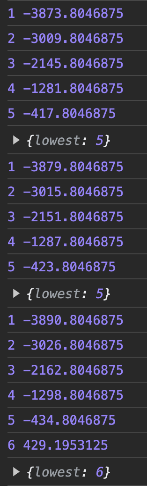

# Exercise 6: Which Page Number?

---

Go and view one of the books.

Notice that `sticky` "PAGE 0"? Well, it's about time we fix that!

We would like that number to update as the user scrolls.

Looking in the DOM, we have something like:

```html
<h1> title </h1>
<section id="page-1">
	<p>...</p>
	<p>...</p>
</section>
<section id="page-2">
	<p>...</p>
	<p>...</p>
</section>
...
```

Each page `section` has `min-height: 100dvh`, so there can only be at most 2 unique pages visible on the screen at once.

---

## Step 1: The Event Listener

The user scrolling is a window event.

We're going to need to add an event listener onto the window.

Often, if you're adding an event listener with `JS` in `React`, you will need to remove it when the component unmounts.

What a perfect opportunity to make leverage `useEffect`!

In the `Book` component, build a `useEffect`, that `console.logs` "scrolling", whenever the user scrolls.

Feel free to comment out your time logging while you work on this.

Make sure to cleanup after yourself!

Don't forget, you'll have to use a named function for your `handleScroll`, otherwise you won't be able to remove the event listener.

---

## Step 2: Find the Pages!

We want to find out the lowest page number the is visible. There are several ways to do this. The most performant way likely involves the `Intersection Observer API`, but implementing it is complicated, and involves two new hooks `useMemo`, and `useRef`. So instead we'll use the tools we have available to us.

Every book has 8 pages, we can also verify this by looking at `foundBook.pages.length`.

So there are 8 elements to test, those of ids, `page-1`, `page-2`, `page-3`, etc.

In your `handleScroll`, remove the "scrolling" logger. Instead, build a `for` loop, that finds each page section in the DOM. Log the page number and the DOM element.

When you scroll, your log should be flooded like so:


---

## Step 3: Which Page is on Top?

We're going to make use of the `getBoundingClientRect` method. This is a method of DOM elements. It returns an object that contains information about the size and position of the element.

Modify your log, to display the `pageSection.getBoundingClientRect().top`.

Scroll around and observe how the top values change as the sections scroll by.

Once the `top` goes negative, the top of that element is above the top of the window.

So how much of each page is on the screen?

Well, `window` has a property of `innerHeight`. If we log `window.innerHeight`, we'll see the vertical px count of the inside of our browser.

Once a page's top has reach negative the window's innerHeight, it is completely above the screen.

We want to identify which page is mostly on the screen. It doesn't have to be exact, but consider aiming for the page with the smallest `top` that is greater than half the `innerHeight`.

Figure out which page this is during the loop and `console.log` it.

Hint: consider using the `break` command to end to the loop prematurely if your test passes.

Once you've got the current page logged, your log should look something like the following:



---

## Step 4: `currentPage` State

The `<PageNumber/>` component is always rendering a 0.

Clearly, we need this to be some state value that can change.

Create a new `currentPage` `useState` in the `Book` component.

Initialize it at 1.

Set it when the user scrolls (the setter should only be called **one** time in your `handleScroll` function).

Pass `currentPage` to `<PageNumber/>` and render it instead of the 0.

Remove your `console.log`s and observe the behavior.

Any errors in the log? Any unexpected results? Always remember to test test test!

Side note: if this breaks down for really small screen sizes, don't worry about it. It's literally impossible to build web applications for every screen size.

---

## Step 5: (Optional) Issues You Probably Haven't Considered

### 5.1: Dynamic Range

Are you running a for loop from 1 to 8? What if a future book has a different number of pages? Better involve the length of that `foundBook.pages` array.

### 5.2: Avoiding 404 Crashes

What happens if the `foundBook` wasn't found? Go test it at "/book/Bimmy", is your page crashing? The `handleScroll` doesn't have to do anything if `foundBook` isn't an object.

### 5.3: Avoiding 404 Crashes

What happens if `document.getElementById` doesn't find an element? This really shouldn't happen, but if `pageSection` is falsy, you should probably issue the `continue` command to ignore that erroneous result and `continue` the loop.

Really anytime you look in the DOM for an element, you should account for the possibility that you fail to find it to avoid an uncaught `JS` error from crashing the browser.

Side note: It's possible to do this without a loop by using `document.querySelectorAll()`. However, the performance difference is minor, and you're likely to use a `forEach` which won't cooperate as well as a loop when trying to only call the setter exactly once.

### 5.4: Limiting Callback Frequency

Finally, is this performant? It's really not for a number of reasons, but the largest reason is that a small scroll fires off MANY scroll events.

We don't need to act on every scroll event, as most of them will yield the same result, and only rarely will we pass a new threshold and need to update `currentPage`.

Throttling and debouncing are two means of limiting function calls. Throttling limits the frequency of function calls. Debouncing waits for a pause in function call requests, and only calls the function after a given rest period has occurred. Both can work in this case, but we do want some updates while scrolling is happening.

Here is a pure `JS` example of combination of throttling and debouncing:

```js
let canRun = true;

const effect = (event) => {
	// some logic / work
}

const handleEvent = (event) => {
	if (canRun) {
		canRun = false;
		effect(event);
		setTimeout(()=>{
			canRun = true;
			effect(event);
		}, delay )
	}
	
}
```

This way, when the event is first fired off the effects happen. Until `delay` elapses, further events are ignored. After the `delay`, the effects will happen again - this will ensure that if the event occurs while `carRun` is `false`, there will still be one upcoming update. A `delay` between 50-250 seems reasonable.

Converting this into a `React` application can be tricky.  If your dependency array is anything other than `[]`, then you can't safely put the `canRun` declaration in the `useEffect` as if there is an update, a new `canRun` will be created. In that case, you would need to use `useRef` or just place the variable in the global scope, above the component declaration.

Here is a half-written template for you to fill in.  You might want to comment out your working `useEffect` or push your work before potentially coding yourself into errors.

```js
//imports

let canRun = true;

const Component = (props) => {
	// ...
	useEffect(()=>{
		const effect = (event) => {
			// the effects you need executed
		}
		const handleEvent = (event) => {
			// same as previous handleEvent
		}
		// addEventListener
		return ()=>{
			// removeEventListener
		}
	}, ? )

	// ...
}
//...
```

To test it, consider providing a long `delay`, like 1000

---

With that, Exercise-6 is complete 🎉

One more for the 100%! [Exercise 7](./exercise-7.md)
