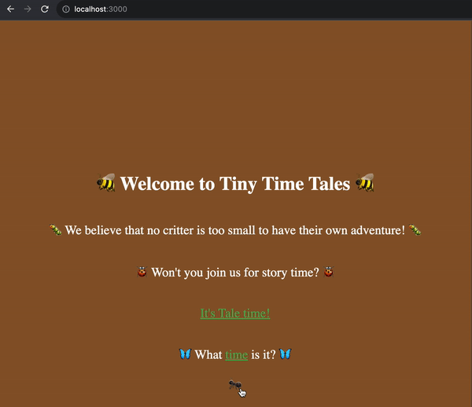

# Exercise 7: Blackboard

---

In this exercise, you're going to build an easter egg that looks something like the following:

As always, the `CSS` is very flexible, and you can choose your methodology.

Here are the requirements to complete this exercise:

1. Add a `Link` to a new "/blackboard" `Route` from `<Introduction/>`.
2. Make a new `<Blackboard/>` component in "/src/pages/Blackboard/index.js".
3. Using `useEffect` and `useState`, track the location of the mouse in `<Blackboard/>`.
4. Cleanup your listener(s) once the user navigates away.
5. Add a tracker (visual indication / UI element) of where the mouse is in `<Blackboard/>`.
6. `<Blackboard/>` should include a `Link` back to "/".  This `Link` must be clickable (i.e. the tracker should not block its click).

Optional Tasks:

7. Make a blackboard in the UI (feel free to use an image).
8. Hide the tracker if outside the blackboard.
9. `Throttle` the execution of your `handleMousemove`.
10. Hide the tracker after mouse movement stops, or fading animations.
11. You choose!

🐜🐜🐜

Have fun!

Wants some [hints](./hints/e7h1.md) for the above points?

---

With that, Exercise-7 is complete 🎉

🟢🟢🟢 Congratulations, you've completed the 100% checkpoint! 🟢🟢🟢

One final challenge awaits you! [Exercise 8](./exercise-8.md)
